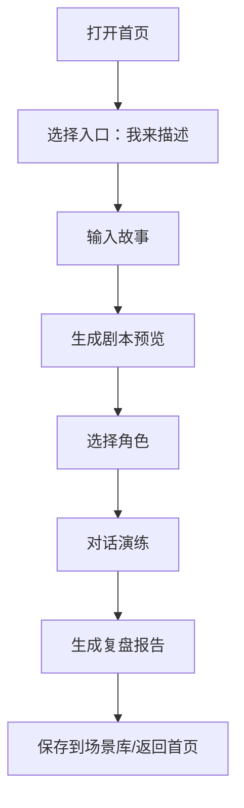

## 1. 产品概述
一个面向儿童与家长/老师的反欺凌教育工具，用“AI + 角色扮演”把真实困扰转成可练习的对话场景，帮助孩子学会表达与自我保护。
- 解决问题：孩子不知道如何开口、如何回应；家长/老师难以快速提供可操作的练习方式
- 目标价值：用低门槛的互动体验提升共情、表达与求助能力，形成可重复练习的安全空间

## 2. 核心功能

### 2.1 功能模块
1. **首页**：价值主张、功能亮点、入口按钮（我来描述/场景库/快速开始）、信任与保障、底部行动召唤
2. **讲述故事**：输入真实经历，生成专属剧本
3. **场景库**：浏览与管理剧本
4. **角色选择与演练**：选择视角进入对话演练
5. **复盘报告**：演练结束输出温暖、具体的复盘建议

### 2.2 页面详情
| 页面名称 | 模块名称 | 功能说明 |
|---|---|---|
| 首页 | 顶部导航/标题区 | 产品名、短句主张、清晰的首次操作入口 |
| 首页 | Hero 视觉区 | 具有情绪的主视觉图，突出“安全、温暖、力量感” |
| 首页 | 快速入口区 | 三个核心按钮：我来描述 / 场景库 / 快速开始 |
| 首页 | 价值说明区 | 以“发生了什么—怎么练—练完得到什么”组织内容 |
| 首页 | 功能亮点区 | 剧本生成、角色视角、复盘报告、可保存与回看 |
| 首页 | 信任与保障区 | 友善语气、非评判性提示、隐私与安全表达（文案层面） |
| 首页 | 行动召唤区 | 固定/底部 CTA：立即开始练习（引导至我来描述） |

## 3. 核心流程
首次用户的最短路径：进入首页 → 点击“我来描述” → 输入故事 → 生成剧本预览 → 开始演练 → 复盘报告 → 返回首页/保存到场景库。

## 4. 用户界面设计

### 4.1 设计风格
- 主色：温暖杏橙（强调）、薄荷青（辅助）、淡紫（点缀）
- 按钮：圆角大、带柔和阴影与按压态；主按钮高对比
- 字体：以系统字体为主（保持易读），标题使用更强的字重与更大字号
- 布局：桌面优先的分区式落地页结构；移动端自动堆叠
- 图形：儿童友好、非幼稚化；使用高质量插画/写实融合风格

### 4.2 页面设计概览
| 页面名称 | 模块名称 | UI 元素 |
|---|---|---|
| 首页 | Hero 视觉区 | 大标题、主视觉图、短描述、主 CTA、轻量动效（渐入/浮动） |
| 首页 | 快速入口区 | 三列卡片按钮（移动端一列/两列）、图标、说明文字 |
| 首页 | 功能亮点区 | 2×2 或 3×2 卡片网格、强调信息层级、悬停态 |
| 首页 | 信任与保障区 | 轻背景、图标与短句、避免“说教感” |
| 首页 | 行动召唤区 | 深色或高对比背景，突出“立即开始” |

### 4.3 响应式
- 桌面优先：最大宽度内容区 + 大留白 + 视觉中心对齐
- 移动端：模块纵向堆叠，按钮触控面积充足，图片自适应裁切
