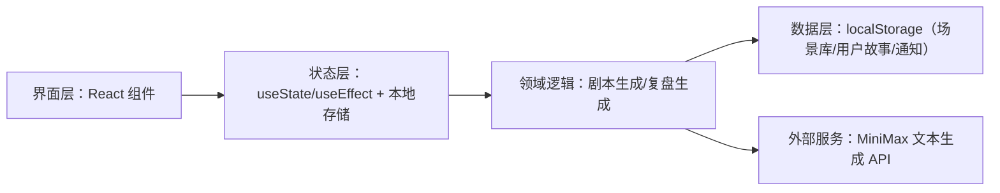
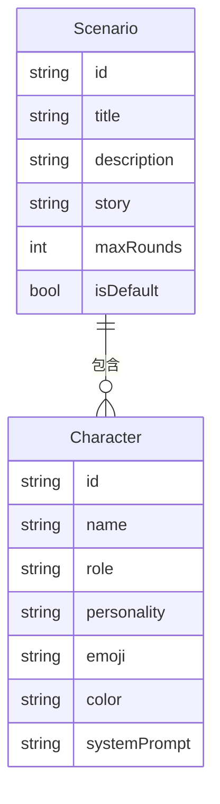

## 1. 架构设计

## 2. 技术说明
- 前端：React@18 + Vite@5
- UI：纯 React + 内联样式对象（保持与现有代码一致），图标使用 lucide-react
- 网络：axios（封装在 api.js）
- 后端：无（仅调用外部文本生成 API）
- 数据：localStorage（场景存储、通知、用户故事）

## 3. 路由定义
| 路径 | 用途 |
|---|---|
| / | 单页应用入口；内部通过 view 状态切换“首页/故事输入/场景库/演练/复盘”等视图 |

## 4. API 定义
由于无自建后端，仅对外部文本生成能力做封装调用：
- 场景生成：输入“用户故事文本”，输出“结构化场景对象”
- 角色对话：输入“对话历史 + 角色提示词”，输出“角色回复文本”
- 复盘生成：输入“对话记录”，输出“复盘报告文本”

## 5. 数据模型
### 5.1 数据模型定义

